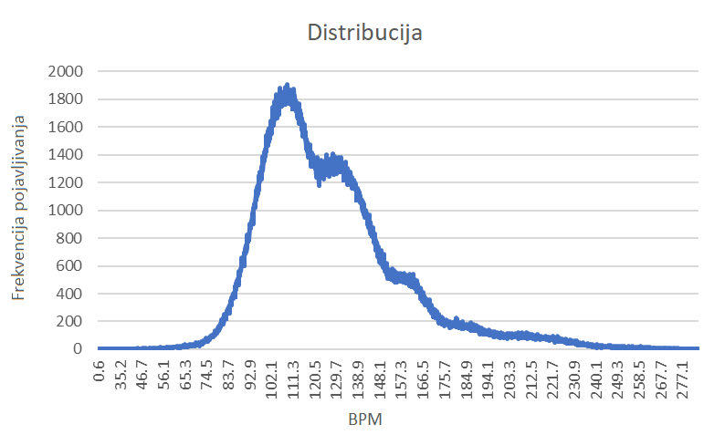

# DJ lista

Podijeliti bazu podataka na više manjih:
 - tako da za svaku manju bazu vrijedi ista distribucija podataka kao i za originalnu ILI
 - grupiranjem BPM-ova (grupe BPM-ova bi trebale ukupno imati otprilike jednak broj pjesama) ILI
 - podijeliti po BPM-u (+ po potrebi unutar grupe tako da distribucija ključeva bude uniformna).

Inzistirati na spajanju po ključevima:
 - to znači da želimo generirati liste s parnim brojem pjesama koje počinju i završavaju s istim ključem
 - (Lako je spojiti između grupa. Problem je spojiti unutar grupe.)

